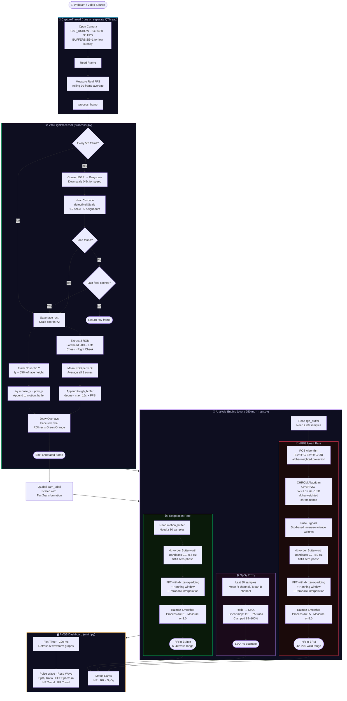

# 🫀 Contactless Vital Sign Monitor

> **Real-time, contactless Heart Rate, Respiration Rate & SpO₂ estimation from a standard webcam.**
> No wearables. No contact. Just your face and a camera.

---

## 🧠 System Architecture Overview

```
┌─────────────────────────────────────────────────────────────────────────────────┐
│                          CONTACTLESS VITAL SIGN MONITOR                         │
│                                                                                 │
│   [Webcam / Video]  ──►  [Capture Thread]  ──►  [VitalSignProcessor]           │
│                                │                         │                      │
│                                │                   ┌─────┴──────────────────┐   │
│                                │                   │  Face Detection (1/5f) │   │
│                                │                   │  ROI Extraction        │   │
│                                │                   │  RGB Buffer            │   │
│                                │                   │  Motion Buffer         │   │
│                                │                   └─────┬──────────────────┘   │
│                                │                         │                      │
│                                ▼                         ▼                      │
│   [PyQt5 UI] ◄── [Plot Timers] ◄── [Analysis Engine] ◄──┘                      │
│       │                              (250 ms cycle)                             │
│       │                                   │                                     │
│       │           ┌───────────────────────┤                                     │
│       │           │                       │                                     │
│       │    [POS + CHROM rPPG]     [RBCG Respiration]                            │
│       │           │                       │                                     │
│       │    [Butterworth Filter]   [Butterworth Filter]                           │
│       │           │                       │                                     │
│       │    [FFT + Parabolic]      [FFT + Parabolic]                             │
│       │           │                       │                                     │
│       │    [Kalman Smoother]      [Kalman Smoother]                             │
│       │           │                       │                                     │
│       └── [HR (BPM)] ──── [RR (Br/min)] ──── [SpO₂ Proxy (%)] ──► [Display]   │
└─────────────────────────────────────────────────────────────────────────────────┘
```

---

## 🔄 Full Pipeline Workflow Diagram



---

## 📦 Project Structure

```
Contactless_Vital_Sign_Monitor/
├── README.md                  ← You are here
└── LIVE_BP/
    ├── main.py                ← PyQt5 Dashboard, Capture Thread, UI Layout, Timers
    ├── processor.py           ← Face Detection, ROI Extraction, GPU-EVM, Frame Annotation
    ├── signals.py             ← POS, CHROM, Butterworth, Kalman, FFT Algorithms
    └── requirements.txt       ← Python dependencies
```

---

## 🔬 Module Deep Dive

### `processor.py` — Video Processing Engine

| Component | Detail |
|---|---|
| **Backend** | `cv2.CAP_DSHOW` (DirectShow) on Windows for minimal latency |
| **Resolution** | 640×480 @ 30 FPS target, `BUFFERSIZE=1` to avoid stale frames |
| **Face Detection** | Haar Cascade (`haarcascade_frontalface_default.xml`), runs every **5th frame** (4× CPU savings), caches last known face for interim frames |
| **ROI Zones** | **Forehead** (centre 60% wide, top 5–25%), **Left Cheek** (5–30% wide, 40–70% high), **Right Cheek** (70–95% wide, 40–70% high) |
| **RGB Sampling** | Mean colour per ROI → average of all 3 zones → pushed to `rgb_buffer` (15 s rolling deque) |
| **Respiration** | Nose-tip Y-position tracked frame-to-frame; Δy per frame pushed to `motion_buffer` |
| **EVM** | GPU Eulerian Video Magnification available (PyTorch/CUDA); disabled in high-FPS mode |

---

### `signals.py` — Signal Processing Algorithms

#### 💓 rPPG — Remote PhotoPlethysmoGraphy

The skin's colour subtly changes with each heartbeat due to blood-volume changes. Two algorithms extract this:

**POS (Plane-Orthogonal-to-Skin)** — Wang et al., IEEE TBME 2017
```
Normalize each RGB channel by its temporal mean:
  S1 = R_norm − G_norm
  S2 = R_norm + G_norm − 2·B_norm
  α  = std(S1) / std(S2)
  pulse_POS = S1 − α·S2
```

**CHROM (Chrominance-Based)** — de Haan & Jeanne, IEEE TBME 2013
```
Normalize each RGB channel by its temporal mean:
  Xc = 3·R_norm − 2·G_norm
  Yc = 1.5·R_norm + G_norm − 1.5·B_norm
  α  = std(Xc) / std(Yc)
  pulse_CHROM = Xc − α·Yc
```

**Fusion** — Inverse-variance weighted average:
```
  w_i = 1 / std(signal_i)
  pulse_fused = (w_POS·POS + w_CHROM·CHROM) / (w_POS + w_CHROM)
```

#### 🌬️ Respiration — RBCG (Remote BallistoCardioGraphy)

Head/chest displacement from breathing causes subtle nose-tip Y-axis motion detectable by the camera:
```
  motion[t] = nose_y[t] − nose_y[t−1]    (pixels/frame)
  Bandpass: 0.1–0.5 Hz  → 6–30 Br/min physiological range
```

#### 🔎 Frequency Estimation — FFT Pipeline
```
  1. Apply Hanning window     → reduce spectral leakage
  2. Zero-pad 4×              → 4× frequency resolution
  3. rfft magnitude           → one-sided power spectrum
  4. Mask to physiological band (HR: 0.7–4.0 Hz · RR: 0.1–0.5 Hz)
  5. Parabolic interpolation  → sub-bin peak refinement
  6. Convert Hz → BPM / Br·min⁻¹
```

#### 📡 Kalman Smoother
Removes jitter from beat-to-beat HR/RR estimates:
```
  Predict:  x̂_k|k-1 = x̂_k-1       P_k|k-1 = P_k-1 + Q
  Update:   K = P_k|k-1 / (P_k|k-1 + R)
            x̂_k = x̂_k|k-1 + K·(z_k − x̂_k|k-1)
            P_k = (1−K)·P_k|k-1
```
- **HR Kalman:** Q = 0.5, R = 5.0 (allows moderate adaptation)
- **RR Kalman:** Q = 0.1, R = 3.0 (more stable / slower adaptation)

#### 🩸 SpO₂ Proxy
A crude photoplethysmographic ratio (not calibrated for medical use):
```
  ratio = mean(R_channel, last 30 frames) / mean(B_channel, last 30 frames)
  SpO₂  = clip(110 − 25 × ratio,  85, 100)   [%]
```

---

### `main.py` — PyQt5 Dashboard

| Component | Detail |
|---|---|
| **Capture Thread** | `QThread` subclass — camera loop runs independently, never blocks UI |
| **Frame Signal** | `pyqtSignal(object, bool)` — emits annotated BGR frame + face-detected flag |
| **Camera Display** | `Qt.FastTransformation` scaling for maximum FPS on the UI label |
| **Plot Timer** | 100 ms (10 Hz) — refreshes all 6 `pyqtgraph` waveforms |
| **Analysis Timer** | 250 ms — runs full DSP pipeline (POS, CHROM, FFT, Kalman) |
| **Rolling Buffers** | Fixed-length `numpy` arrays with `np.roll` — constant memory, always newest data on right |
| **Plots** | Pulse wave (filled), Resp wave, SpO₂ ratio, FFT spectrum, HR trend, RR trend |

---

## ⚡ Performance Optimizations

| Optimization | Impact |
|---|---|
| `cv2.CAP_DSHOW` backend | Lower latency on Windows vs default |
| `BUFFERSIZE=1` | Always reads newest frame, no queue buildup |
| Face detection every 5th frame | ~4× CPU reduction on detection; cached rect used in between |
| EVM disabled in high-FPS mode | ~2–3× FPS gain (GPU EVM re-enabled for signal quality mode) |
| `Qt.FastTransformation` | Fast nearest-neighbour scaling for camera label |
| `np.roll` buffers | O(n) numpy shift, no Python list overhead |
| Separate `QThread` for capture | UI never stutters due to camera I/O |
| `pg.setConfigOptions(antialias=True)` | Smooth plot lines without performance loss (GPU-accelerated) |

---

## 🛠️ Setup

```bash
pip install -r requirements.txt
```

**Key dependencies:**
- `opencv-python` — face detection, camera capture, frame processing
- `PyQt5` — GUI framework
- `pyqtgraph` — real-time scrolling waveform plots
- `torch` — GPU-accelerated Eulerian Video Magnification (optional CUDA)
- `scipy` — Butterworth bandpass filter (`butter`, `filtfilt`)
- `numpy` — array operations, FFT

---

## 🚀 Run

```bash
python main.py                   # default webcam (index 0)
python main.py --source 1        # alternate webcam
python main.py --source video.mp4
```

---

## 📡 Timing & Buffer Sizes

| Parameter | Value | Reason |
|---|---|---|
| `BUFFER_SECONDS` | 15 s | Enough data for robust low-frequency FFT resolution |
| `PLOT_SECONDS` | 8 s | Visible waveform window without crowding |
| `CAM_FPS_TARGET` | 30 FPS | Standard webcam; Nyquist covers up to 4 Hz (240 BPM) |
| `PLOT_UPDATE_MS` | 100 ms | 10 Hz plot refresh — smooth scrolling, low CPU |
| `ANALYSIS_UPDATE_MS` | 250 ms | 4 Hz analysis — responsive but not wasteful |
| HR band | 0.7–4.0 Hz | Covers 42–240 BPM physiological range |
| RR band | 0.1–0.5 Hz | Covers 6–30 Br/min physiological range |
| FFT zero-padding | 4× | Improves frequency resolution without extra data |
| Minimum buffer (FFT) | 60 samples | ≈ 2 s at 30 FPS — minimum for stable spectrum |

---

## 💡 Tips for Best Accuracy

- 💡 Use **good, even frontal lighting** — avoid backlighting or flickering LED lights
- 🧘 Sit **still** — head motion adds noise to both rPPG and respiration signals
- 📏 Keep face **30–60 cm** from the camera
- ⏱️ Allow **~10 seconds** of buffering before readings stabilise (watch the "Buffering" state)
- 🎯 Ensure **forehead and both cheeks** are clearly visible — these are the primary ROI zones
- 🌡️ Readings are most accurate in a **temperature-stable** environment (minimal skin flushing)

---

## ⚠️ Disclaimer

> This system is a **research prototype** and is **NOT medically certified**.
> SpO₂ values are a proxy estimate only and must not be used for clinical decisions.
> Always consult a qualified healthcare professional for medical monitoring.
