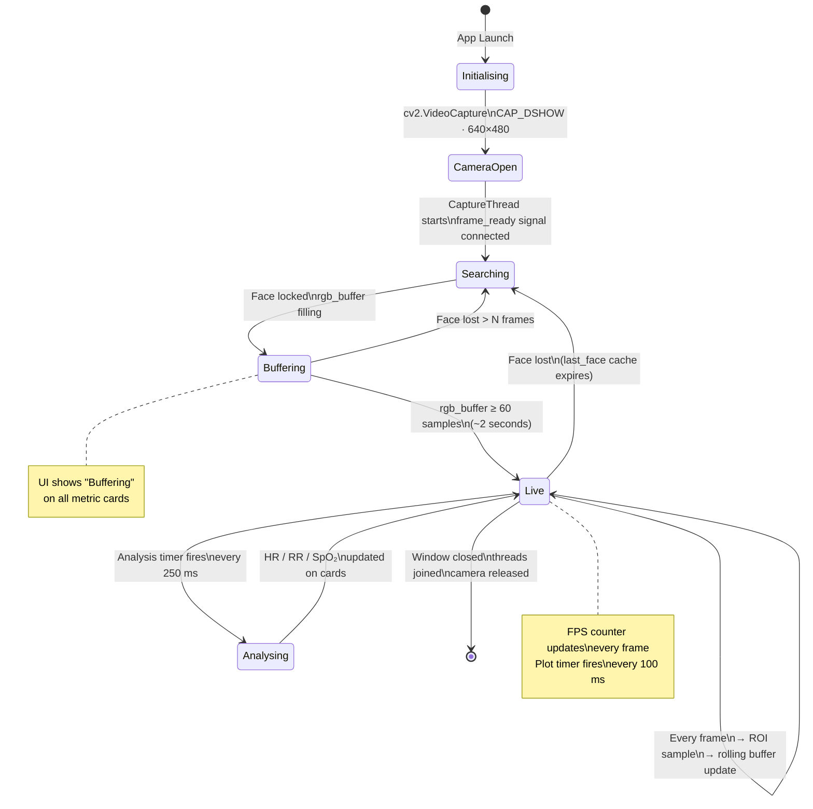
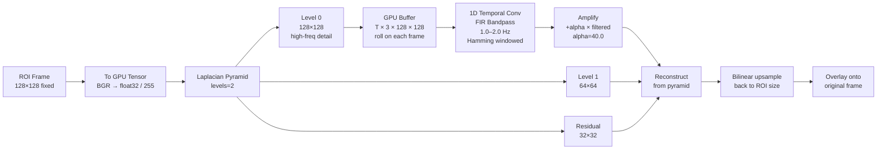
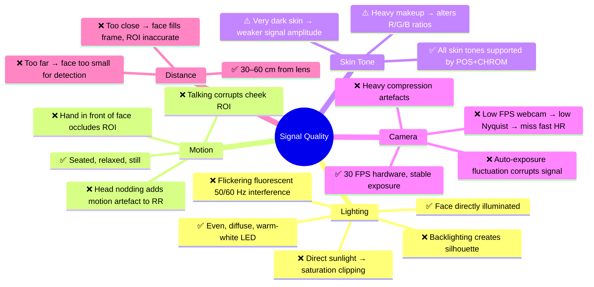

# 🫀 Contactless Vital Sign Monitor

> **Real-time, contactless Heart Rate, Respiration Rate & SpO₂ estimation from a standard webcam.**
> No wearables. No contact. Just your face and a camera.

---

## 🧠 System Architecture Overview

```
┌─────────────────────────────────────────────────────────────────────────────────┐
│                          CONTACTLESS VITAL SIGN MONITOR                         │
│                                                                                 │
│   [Webcam / Video]  ──►  [Capture Thread]  ──►  [VitalSignProcessor]           │
│                                │                         │                      │
│                                │                   ┌─────┴──────────────────┐   │
│                                │                   │  Face Detection (1/5f) │   │
│                                │                   │  ROI Extraction        │   │
│                                │                   │  RGB Buffer            │   │
│                                │                   │  Motion Buffer         │   │
│                                │                   └─────┬──────────────────┘   │
│                                │                         │                      │
│                                ▼                         ▼                      │
│   [PyQt5 UI] ◄── [Plot Timers] ◄── [Analysis Engine] ◄──┘                      │
│       │                              (250 ms cycle)                             │
│       │                                   │                                     │
│       │           ┌───────────────────────┤                                     │
│       │           │                       │                                     │
│       │    [POS + CHROM rPPG]     [RBCG Respiration]                            │
│       │           │                       │                                     │
│       │    [Butterworth Filter]   [Butterworth Filter]                           │
│       │           │                       │                                     │
│       │    [FFT + Parabolic]      [FFT + Parabolic]                             │
│       │           │                       │                                     │
│       │    [Kalman Smoother]      [Kalman Smoother]                             │
│       │           │                       │                                     │
│       └── [HR (BPM)] ──── [RR (Br/min)] ──── [SpO₂ Proxy (%)] ──► [Display]   │
└─────────────────────────────────────────────────────────────────────────────────┘
```

---

## 🔄 Full Pipeline Workflow Diagram


---

## 📦 Project Structure

```
Contactless_Vital_Sign_Monitor/
├── README.md                  ← You are here
└── LIVE_BP/
    ├── main.py                ← PyQt5 Dashboard, Capture Thread, UI Layout, Timers
    ├── processor.py           ← Face Detection, ROI Extraction, GPU-EVM, Frame Annotation
    ├── signals.py             ← POS, CHROM, Butterworth, Kalman, FFT Algorithms
    └── requirements.txt       ← Python dependencies
```

---

## 🔬 Module Deep Dive

### `processor.py` — Video Processing Engine

| Component | Detail |
|---|---|
| **Backend** | `cv2.CAP_DSHOW` (DirectShow) on Windows for minimal latency |
| **Resolution** | 640×480 @ 30 FPS target, `BUFFERSIZE=1` to avoid stale frames |
| **Face Detection** | Haar Cascade (`haarcascade_frontalface_default.xml`), runs every **5th frame** (4× CPU savings), caches last known face for interim frames |
| **ROI Zones** | **Forehead** (centre 60% wide, top 5–25%), **Left Cheek** (5–30% wide, 40–70% high), **Right Cheek** (70–95% wide, 40–70% high) |
| **RGB Sampling** | Mean colour per ROI → average of all 3 zones → pushed to `rgb_buffer` (15 s rolling deque) |
| **Respiration** | Nose-tip Y-position tracked frame-to-frame; Δy per frame pushed to `motion_buffer` |
| **EVM** | GPU Eulerian Video Magnification available (PyTorch/CUDA); disabled in high-FPS mode |

---

### `signals.py` — Signal Processing Algorithms

#### 💓 rPPG — Remote PhotoPlethysmoGraphy

The skin's colour subtly changes with each heartbeat due to blood-volume changes. Two algorithms extract this:

**POS (Plane-Orthogonal-to-Skin)** — Wang et al., IEEE TBME 2017
```
Normalize each RGB channel by its temporal mean:
  S1 = R_norm − G_norm
  S2 = R_norm + G_norm − 2·B_norm
  α  = std(S1) / std(S2)
  pulse_POS = S1 − α·S2
```

**CHROM (Chrominance-Based)** — de Haan & Jeanne, IEEE TBME 2013
```
Normalize each RGB channel by its temporal mean:
  Xc = 3·R_norm − 2·G_norm
  Yc = 1.5·R_norm + G_norm − 1.5·B_norm
  α  = std(Xc) / std(Yc)
  pulse_CHROM = Xc − α·Yc
```

**Fusion** — Inverse-variance weighted average:
```
  w_i = 1 / std(signal_i)
  pulse_fused = (w_POS·POS + w_CHROM·CHROM) / (w_POS + w_CHROM)
```

#### 🌬️ Respiration — RBCG (Remote BallistoCardioGraphy)

Head/chest displacement from breathing causes subtle nose-tip Y-axis motion detectable by the camera:
```
  motion[t] = nose_y[t] − nose_y[t−1]    (pixels/frame)
  Bandpass: 0.1–0.5 Hz  → 6–30 Br/min physiological range
```

#### 🔎 Frequency Estimation — FFT Pipeline
```
  1. Apply Hanning window     → reduce spectral leakage
  2. Zero-pad 4×              → 4× frequency resolution
  3. rfft magnitude           → one-sided power spectrum
  4. Mask to physiological band (HR: 0.7–4.0 Hz · RR: 0.1–0.5 Hz)
  5. Parabolic interpolation  → sub-bin peak refinement
  6. Convert Hz → BPM / Br·min⁻¹
```

#### 📡 Kalman Smoother
Removes jitter from beat-to-beat HR/RR estimates:
```
  Predict:  x̂_k|k-1 = x̂_k-1       P_k|k-1 = P_k-1 + Q
  Update:   K = P_k|k-1 / (P_k|k-1 + R)
            x̂_k = x̂_k|k-1 + K·(z_k − x̂_k|k-1)
            P_k = (1−K)·P_k|k-1
```
- **HR Kalman:** Q = 0.5, R = 5.0 (allows moderate adaptation)
- **RR Kalman:** Q = 0.1, R = 3.0 (more stable / slower adaptation)

#### 🩸 SpO₂ Proxy
A crude photoplethysmographic ratio (not calibrated for medical use):
```
  ratio = mean(R_channel, last 30 frames) / mean(B_channel, last 30 frames)
  SpO₂  = clip(110 − 25 × ratio,  85, 100)   [%]
```

---

### `main.py` — PyQt5 Dashboard

| Component | Detail |
|---|---|
| **Capture Thread** | `QThread` subclass — camera loop runs independently, never blocks UI |
| **Frame Signal** | `pyqtSignal(object, bool)` — emits annotated BGR frame + face-detected flag |
| **Camera Display** | `Qt.FastTransformation` scaling for maximum FPS on the UI label |
| **Plot Timer** | 100 ms (10 Hz) — refreshes all 6 `pyqtgraph` waveforms |
| **Analysis Timer** | 250 ms — runs full DSP pipeline (POS, CHROM, FFT, Kalman) |
| **Rolling Buffers** | Fixed-length `numpy` arrays with `np.roll` — constant memory, always newest data on right |
| **Plots** | Pulse wave (filled), Resp wave, SpO₂ ratio, FFT spectrum, HR trend, RR trend |

---

## ⚡ Performance Optimizations

| Optimization | Impact |
|---|---|
| `cv2.CAP_DSHOW` backend | Lower latency on Windows vs default |
| `BUFFERSIZE=1` | Always reads newest frame, no queue buildup |
| Face detection every 5th frame | ~4× CPU reduction on detection; cached rect used in between |
| EVM disabled in high-FPS mode | ~2–3× FPS gain (GPU EVM re-enabled for signal quality mode) |
| `Qt.FastTransformation` | Fast nearest-neighbour scaling for camera label |
| `np.roll` buffers | O(n) numpy shift, no Python list overhead |
| Separate `QThread` for capture | UI never stutters due to camera I/O |
| `pg.setConfigOptions(antialias=True)` | Smooth plot lines without performance loss (GPU-accelerated) |

---

## 🛠️ Setup

```bash
pip install -r requirements.txt
```

**Key dependencies:**
- `opencv-python` — face detection, camera capture, frame processing
- `PyQt5` — GUI framework
- `pyqtgraph` — real-time scrolling waveform plots
- `torch` — GPU-accelerated Eulerian Video Magnification (optional CUDA)
- `scipy` — Butterworth bandpass filter (`butter`, `filtfilt`)
- `numpy` — array operations, FFT

---

## 🚀 Run

```bash
python main.py                   # default webcam (index 0)
python main.py --source 1        # alternate webcam
python main.py --source video.mp4
```

---

## 📡 Timing & Buffer Sizes

| Parameter | Value | Reason |
|---|---|---|
| `BUFFER_SECONDS` | 15 s | Enough data for robust low-frequency FFT resolution |
| `PLOT_SECONDS` | 8 s | Visible waveform window without crowding |
| `CAM_FPS_TARGET` | 30 FPS | Standard webcam; Nyquist covers up to 4 Hz (240 BPM) |
| `PLOT_UPDATE_MS` | 100 ms | 10 Hz plot refresh — smooth scrolling, low CPU |
| `ANALYSIS_UPDATE_MS` | 250 ms | 4 Hz analysis — responsive but not wasteful |
| HR band | 0.7–4.0 Hz | Covers 42–240 BPM physiological range |
| RR band | 0.1–0.5 Hz | Covers 6–30 Br/min physiological range |
| FFT zero-padding | 4× | Improves frequency resolution without extra data |
| Minimum buffer (FFT) | 60 samples | ≈ 2 s at 30 FPS — minimum for stable spectrum |

---

## 💡 Tips for Best Accuracy

- 💡 Use **good, even frontal lighting** — avoid backlighting or flickering LED lights
- 🧘 Sit **still** — head motion adds noise to both rPPG and respiration signals
- 📏 Keep face **30–60 cm** from the camera
- ⏱️ Allow **~10 seconds** of buffering before readings stabilise (watch the "Buffering" state)
- 🎯 Ensure **forehead and both cheeks** are clearly visible — these are the primary ROI zones
- 🌡️ Readings are most accurate in a **temperature-stable** environment (minimal skin flushing)

---

## ⚠️ Disclaimer

> This system is a **research prototype** and is **NOT medically certified**.
> SpO₂ values are a proxy estimate only and must not be used for clinical decisions.
> Always consult a qualified healthcare professional for medical monitoring.

---

## 🔁 Application State Machine

The app moves through well-defined states from launch to steady-state monitoring:



---

## 📐 ROI Zone Map

The face bounding box is divided into anatomical regions for optimal signal quality. Each region is chosen to maximise perfusion signal and minimise specular reflection:

```
  Face Bounding Box  (fx, fy, fw, fh)
  ┌──────────────────────────────────┐
  │          ← fw (100%) →          │
  │  ┌────────────────────────────┐  │ ▲
  │  │    ← 60% centered →       │  │ │ 5%
  │  ├────────────────────────────┤  │ ▼ fy
  │  │   🟢 FOREHEAD ROI          │  │
  │  │   fh_x = fx + 20%fw        │  │ ▲
  │  │   fh_y = fy +  5%fh        │  │ │ 20%fh
  │  │   fh_w = 60%fw             │  │ ▼
  │  └────────────────────────────┘  │
  │                                  │
  │  Eyes / Nose (skipped — motion)  │
  │                                  │
  │ ┌───────┐            ┌───────┐   │ ▲
  │ │🟠LEFT │            │🟠RIGHT│   │ │
  │ │CHEEK  │            │CHEEK  │   │ │ 30%fh
  │ │ 25%fw │            │ 25%fw │   │ │
  │ └───────┘            └───────┘   │ ▼
  │  lc_x=5%fw          rc_x=70%fw  │
  │                                  │
  │      👃 Nose-tip tracked         │ ← fy + 55%fh
  │         for Δy respiration       │
  └──────────────────────────────────┘

  RGB signal = mean(Forehead) + mean(Left Cheek) + mean(Right Cheek)
               ──────────────────────────────────────────────────────
                                      3
```

**Why these three zones?**
| Zone | Reason |
|---|---|
| Forehead | High capillary density, flat surface → low specular glare, strong rPPG signal |
| Left Cheek | Large skin area, good perfusion, less affected by lip movements |
| Right Cheek | Symmetric redundancy — averages out left-right lighting asymmetry |
| Nose-tip (motion only) | Amplifies chest/diaphragm breathing displacement along Y axis |

---

## 📊 Signal Processing Data Flow

### Stage 1 — Raw RGB Extraction

```
Frame[t]  →  ROI crop  →  pixel mean  →  rgb[t] = [R̄, Ḡ, B̄]
                                              ↓
                                   rgb_buffer  (deque, 15 s × 30 FPS = 450 pts)
```

### Stage 2 — rPPG Signal Construction

```
rgb_buffer  (N × 3)
     │
     ├──► POS ──────────────────────────────────────────────────────────────►┐
     │    Normalize: C_norm = C / mean(C)                                    │
     │    S1 = R_n − G_n                                                     │
     │    S2 = R_n + G_n − 2·B_n                                            ├──► FUSE
     │    pulse_POS = S1 − (σS1/σS2)·S2                                     │
     │                                                                        │
     └──► CHROM ────────────────────────────────────────────────────────────►┘
          Normalize: C_norm = C / mean(C)
          Xc = 3R_n − 2G_n
          Yc = 1.5R_n + G_n − 1.5B_n
          pulse_CHROM = Xc − (σXc/σYc)·Yc

FUSE: w_i = 1/σ_i  →  pulse = (w_POS·POS + w_CHROM·CHROM) / (w_POS + w_CHROM)
```

### Stage 3 — Filtering & Frequency Analysis

```
pulse_fused
     │
     ▼
┌─────────────────────────────────────────────┐
│  4th-order Butterworth Bandpass             │
│  f_low = 0.7 Hz  f_high = 4.0 Hz           │
│  filtfilt() → zero phase lag               │
└─────────────────┬───────────────────────────┘
                  │
                  ▼
┌─────────────────────────────────────────────┐
│  FFT Frequency Estimation                   │
│  1. Hanning window × signal                 │
│  2. rfft(signal, n = N×4)  ← 4× zero pad  │
│  3. Mask: 0.7 Hz ≤ f ≤ 4.0 Hz             │
│  4. argmax → peak bin                       │
│  5. Parabolic interpolation (sub-bin)       │
│  6. f_dominant × 60 → BPM                  │
└─────────────────┬───────────────────────────┘
                  │
                  ▼
┌─────────────────────────────────────────────┐
│  Kalman Filter 1D                           │
│  Q = 0.5  R = 5.0                          │
│  Smooths beat-to-beat jitter               │
└─────────────────┬───────────────────────────┘
                  │
                  ▼
            HR (BPM) displayed
            Guard: 40 < HR < 200
```

### Stage 4 — Respiration Path

```
nose_y[t] − nose_y[t−1]  →  motion_buffer  (deque, 15 s)
                                   │
                    ┌──────────────▼──────────────┐
                    │  Butterworth 0.1–0.5 Hz      │
                    │  filtfilt zero-phase          │
                    └──────────────┬──────────────┘
                                   │
                    ┌──────────────▼──────────────┐
                    │  FFT + Parabolic peak        │
                    │  f × 60 → Br/min            │
                    └──────────────┬──────────────┘
                                   │
                    ┌──────────────▼──────────────┐
                    │  Kalman  Q=0.1  R=3.0        │
                    └──────────────┬──────────────┘
                                   │
                            RR (Br/min) displayed
                            Guard: 6 < RR < 40
```

---

## 🎮 GPU Eulerian Video Magnification (EVM) — Deep Dive

> EVM amplifies invisible colour changes in the face that correspond to blood flow. While disabled in the default high-FPS mode, it can be re-enabled for research/signal-quality use.



**Key EVM Parameters:**

| Parameter | Value | Effect |
|---|---|---|
| `buffer_size` | 32 frames | Temporal window for FIR filter (~1 s at 30 FPS) |
| `alpha` | 40.0 | Amplification factor — higher = more visible pulse |
| `low_hz` | 1.0 Hz | Lower bound of amplified frequency (~60 BPM) |
| `high_hz` | 2.0 Hz | Upper bound of amplified frequency (~120 BPM) |
| `levels` | 2 | Laplacian pyramid levels — 2 is fast; 3 is richer |
| `target_size` | 128×128 | Fixed GPU buffer size — avoids tensor shape mismatches |

**FIR Kernel Construction (Sinc-Hamming):**
```
t = [−(N−1)/2 ... (N−1)/2]
kernel = sinc(w_high·t)·w_high/π  −  sinc(w_low·t)·w_low/π
kernel *= hamming_window(N)
```

---

## ⚖️ Algorithm Comparison

### rPPG Method Comparison

| Feature | POS | CHROM | Fused |
|---|---|---|---|
| **Year** | 2017 | 2013 | — |
| **Signal space** | Projection orthogonal to skin tone | Chrominance (skin-detrended) | Weighted combination |
| **Strength** | Motion-robust with colour normalisation | Robust to illumination changes | Best of both |
| **Weakness** | Sensitive to bright specular highlights | Requires stable white balance | Slightly more compute |
| **Our use** | Primary | Secondary | ✅ Final output |

### Frequency Estimation Comparison

| Method | Resolution | Sub-bin? | Leakage? | Used here? |
|---|---|---|---|---|
| Basic argmax FFT | Δf = fs/N | ❌ | High | ❌ |
| Zero-padded FFT (4×) | Δf = fs/(4N) | ❌ | Medium | Partial |
| Zero-pad + Hanning window | Δf = fs/(4N) | ❌ | Low | Partial |
| Zero-pad + Hanning + Parabolic | Sub-bin interpolated | ✅ | Low | ✅ |

### Filtering Comparison

| Filter | Phase distortion | Ringing | Real-time? | Used here? |
|---|---|---|---|---|
| `lfilter` (causal) | Yes | Low | ✅ | ❌ |
| `filtfilt` (zero-phase) | None | Slightly more | ❌ (batch) | ✅ |
| Moving average | None | High | ✅ | ❌ |
| Kalman (1D) | None | None | ✅ | ✅ (post-FFT) |

---

## 🖥️ UI Layout Map

```
┌────────────────────────────────────────────────────────────────────┐
│  🔴 LIVE          23.4 fps          20:38:39                       │  ← Header bar
├──────────────────────────────┬─────────────────────────────────────┤
│                              │  📡 Contactless Vital Sign Monitor  │
│   ┌──────────────────────┐   │  ─────────────────────────────────  │
│   │                      │   │  ❤ Pulse Wave (rPPG)               │
│   │   LIVE CAMERA FEED   │   │  ~~~~~~~~~~~~~~~~~~~~~~~~~~~~~~~~~~~│ ← filled waveform
│   │   640 × 480 display  │   │  ─────────────────────────────────  │
│   │   (aspect preserved) │   │  🌬 Respiration (RBCG)             │
│   │   • teal face rect   │   │  ~~~~~~~~~~~~~~~~~~~~~~~~~~~~~~~~~~~│
│   │   • green forehead   │   │  ─────────────────────────────────  │
│   │   • orange cheeks    │   │  🩸 SpO₂ Proxy (R/B ratio)        │
│   └──────────────────────┘   │  ~~~~~~~~~~~~~~~~~~~~~~~~~~~~~~~~~~~│
│  ✅ Face locked — capturing  │  ─────────────────────────────────  │
│  ─────────────────────────── │  📊 HR Spectrum (FFT)              │
│ ┌────────┐┌────────┐┌──────┐ │  ~~~~~~~~~~~~~~~~~~~~~~~~~~~~~~~~~~~│
│ │ HEART  ││ RESP   ││ SpO₂ │ │  ─────────────────────────────────  │
│ │  RATE  ││ RATE   ││PROXY │ │  ┌───────────────┬───────────────┐ │
│ │        ││        ││      │ │  │  HR Trend     │  RR Trend     │ │
│ │  72bpm ││  16b/m ││  98% │ │  │  last 60 s   │  last 60 s   │ │
│ └────────┘└────────┘└──────┘ │  └───────────────┴───────────────┘ │
│                              │  Pipeline footer text               │
└──────────────────────────────┴─────────────────────────────────────┘
  ← LEFT panel (stretch=0)      ← RIGHT panel (stretch=1, resizable)
```

**Timer Coordination:**

```mermaid
gantt
    title Timer Schedule (repeating cycle shown over 1 second)
    dateFormat x
    axisFormat %Lms

    section Camera Thread
    Frame capture (continuous)  : active, 0, 1000

    section Plot Timer (100ms)
    Refresh plots               : 0,   100
    Refresh plots               : 100, 200
    Refresh plots               : 200, 300
    Refresh plots               : 300, 400
    Refresh plots               : 400, 500
    Refresh plots               : 500, 600
    Refresh plots               : 600, 700
    Refresh plots               : 700, 800
    Refresh plots               : 800, 900
    Refresh plots               : 900, 1000

    section Analysis Timer (250ms)
    DSP pipeline run            : 0,   250
    DSP pipeline run            : 250, 500
    DSP pipeline run            : 500, 750
    DSP pipeline run            : 750, 1000

    section Clock Timer (1000ms)
    REC blink + clock           : 0,   1000
```



---

## 🛡️ Error Handling & Guard Rails

The system includes multiple layers of defensive programming to ensure stability:

| Guard | Location | Condition | Action |
|---|---|---|---|
| Camera read fail | `CaptureThread.run` | `ret == False` | `sleep(0.01)` and retry |
| No face, no cache | `process_frame` | `faces=[]` and `_last_face=None` | Return raw frame unmodified |
| Buffer too short | `_analyse` | `len(rgb_buf) < 60` | Show "Buffering" on cards, skip DSP |
| Filter too short | `bandpass_filter` | `len(signal) < 36` | Return signal unfiltered |
| FFT no band data | `estimate_rate_fft` | `not mask.any()` | Return 0.0 |
| HR out of range | `_analyse` | `hr < 40` or `hr > 200` | Discard, don't update display |
| RR out of range | `_analyse` | `rr < 6` or `rr > 40` | Discard, don't update display |
| SpO₂ divide-by-zero | `_analyse` | `b_mean == 0` | Skip SpO₂ update |
| FFT divide-by-zero | `estimate_rate_fft` | `len(signal) < 10` | Return 0.0 |
| Kalman divide-by-zero | `KalmanFilter1D` | Denominator `+ 1e-9` | Numerically stable |
| EVM empty ROI | `GPUEulerianMagnifier.push` | `roi_bgr.size == 0` | Return original frame |
| Filter clamp | `butter_bandpass` | Frequencies outside (0,1) Nyquist | Clamped to `[1e-5, 0.9999]` |

---

## 🔬 Signal Quality — What Affects Accuracy



---

## 🔭 Future Enhancements

| Feature | Description | Complexity |
|---|---|---|
| **MediaPipe Face Mesh** | Replace Haar Cascade with 468-landmark mesh for precise ROI (file already present: `face_landmarker.task`) | Medium |
| **Auto-exposure lock** | Send V4L2 / DSHOW property to freeze exposure → eliminates illumination drift | Low |
| **Adaptive EVM toggle** | Enable EVM when FPS > 25, disable when < 20 for automatic quality/speed balance | Low |
| **PPG peak detection** | Mark R-peaks on pulse waveform → beat-to-beat HRV analysis | Medium |
| **HRV metrics** | RMSSD, pNN50, SDNN from inter-beat intervals → stress/ANS assessment | Medium |
| **Breathing pattern** | Classify eupnea / tachypnea / bradypnea from RR + waveform shape | Medium |
| **Multi-face support** | Track multiple faces simultaneously, report vitals per face | High |
| **Recording & export** | Save timestamped CSV of HR/RR/SpO₂ for longitudinal analysis | Low |
| **ONNX/TensorRT face** | Replace OpenCV Haar with lightweight DNN detector for GPU-accelerated detection | High |
| **Contact-free SpO₂** | Use ratio-of-ratios (RoR) between AC/DC of red and IR channels | High |

---

## 📚 Scientific References

| Algorithm | Paper | Journal |
|---|---|---|
| **POS rPPG** | Wang, W. et al., "Algorithmic Principles of Remote PPG", 2017 | IEEE Trans. Biomed. Eng. |
| **CHROM rPPG** | de Haan, G. & Jeanne, V., "Robust Pulse Rate From Chrominance-Based rPPG", 2013 | IEEE Trans. Biomed. Eng. |
| **Eulerian Video Magnification** | Wu, H. et al., "Eulerian Video Magnification for Revealing Subtle Changes in the World", 2012 | ACM SIGGRAPH |
| **RBCG Respiration** | Janssen, R. et al., "Video-based Respiration Monitoring with Automatic Region of Interest Detection", 2016 | Physiol. Meas. |
| **Butterworth Filter** | Butterworth, S., "On the Theory of Filter Amplifiers", 1930 | Experimental Wireless |
| **Kalman Filter** | Kalman, R.E., "A New Approach to Linear Filtering and Prediction Problems", 1960 | J. Basic Engineering |
| **Parabolic Interpolation** | Quinn, B.G., "Estimating Frequency of a Sinusoid", 1994 | IEEE Trans. Signal Process. |

---

## 🧪 Development & Debug Tips

```bash
# Check if CUDA is available for EVM
python -c "import torch; print(torch.cuda.is_available(), torch.cuda.get_device_name(0))"

# Check actual FPS being delivered by webcam
python -c "
import cv2, time
cap = cv2.VideoCapture(0, cv2.CAP_DSHOW)
t = time.time()
for _ in range(60): cap.read()
print(f'Real FPS: {60 / (time.time() - t):.1f}')
cap.release()
"

# List available cameras
python -c "
import cv2
for i in range(5):
    c = cv2.VideoCapture(i, cv2.CAP_DSHOW)
    if c.isOpened(): print(f'Camera {i} available')
    c.release()
"

# Profile the DSP pipeline
python -c "
import cProfile
import pstats
from signals import compute_pos, compute_chrom
import numpy as np
data = np.random.rand(450, 3)
cProfile.run('for _ in range(100): compute_pos(data)', '/tmp/prof')
p = pstats.Stats('/tmp/prof')
p.sort_stats('cumulative').print_stats(10)
"
```

**Common issues:**

| Symptom | Likely Cause | Fix |
|---|---|---|
| `-- fps` shown, camera black | Camera index wrong | Try `--source 1` or `--source 2` |
| Always "Buffering" | Face not detected | Improve lighting, move closer |
| HR stuck at same value | Signal saturated (auto-exposure) | Cover lens briefly to reset, or lock exposure |
| HR wildly jumping | Too much head motion | Sit still; Kalman will stabilise in ~5 s |
| Low FPS (< 15) | EVM enabled + no GPU | EVM is disabled by default for FPS; check `processor.py` |
| `filtfilt` error | Signal too short | Wait for buffer to fill (≥ 60 samples / ~2 s) |
| Qt import error | PyQt5 missing | `pip install PyQt5==5.15.10` |

